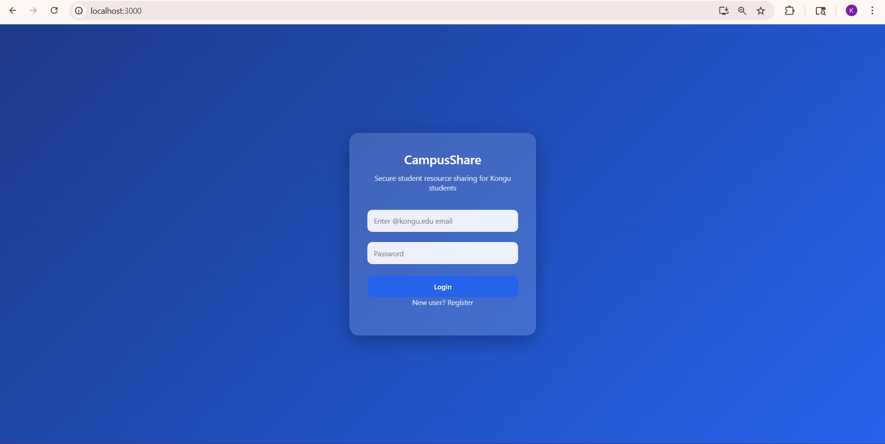
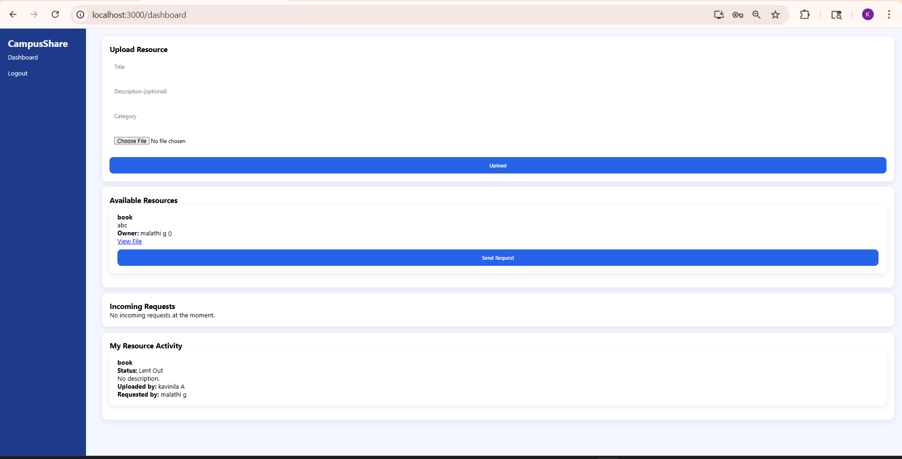
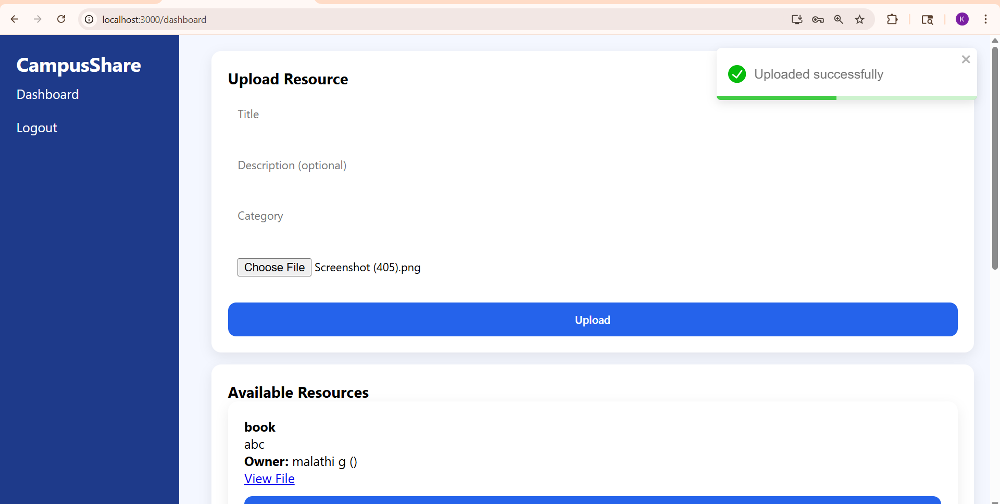
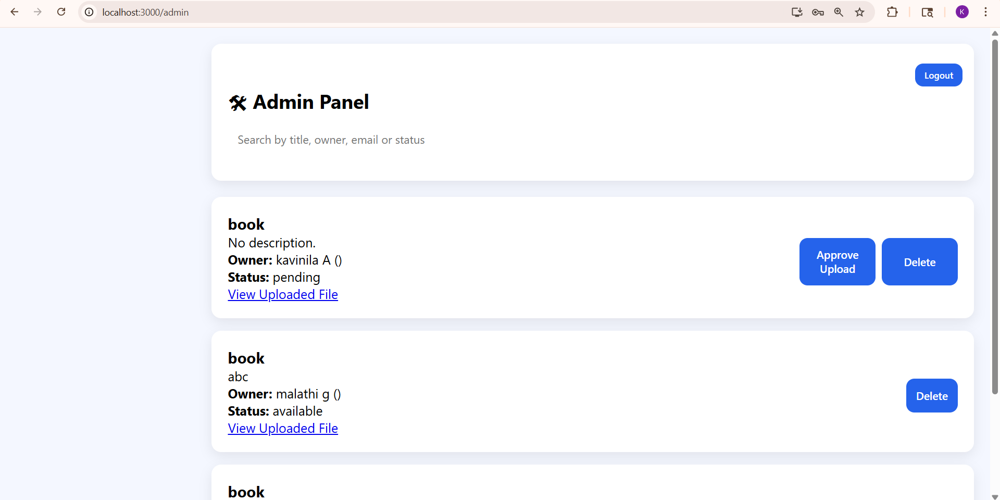
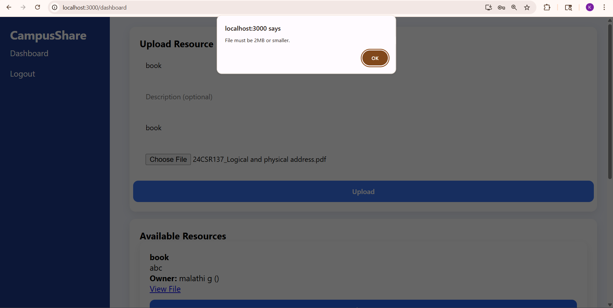

# 📚 CampusShare

**CampusShare** is a full-stack web application designed to streamline the sharing and management of campus resources through secure user authentication and role-based administration.

---

## 🚀 Features

* 🔐 User Authentication (Login & Register)
* 🛠️ Admin Dashboard
* 📦 Resource Upload & Management
* 📊 User Dashboard
* 🌐 Full-stack Architecture (Frontend + Backend)

---

## 🏗️ Tech Stack

**Frontend**

* React.js
* HTML, CSS, JavaScript

**Backend**

* Node.js
* Express.js

**Database**

* MongoDB

---

## 📁 Project Structure

```
campusshare/
├── frontend/
├── backend/
├── screenshots/
```

---

## ⚙️ Installation

### 1. Clone Repository

```
git clone https://github.com/Kavinila2369/campusshare.git
cd campusshare
```

### 2. Install Backend

```
cd backend
npm install
```

### 3. Install Frontend

```
cd ../frontend
npm install
```

---

## ▶️ Run the Project

### Start Backend

```
cd backend
npm start
```

### Start Frontend

```
cd frontend
npm start
```

---

## 🔑 Environment Variables

Create a `.env` file inside the backend folder:

```
MONGO_URI=your_mongodb_connection
JWT_SECRET=your_secret_key
```

---

## 📸 Screenshots

<p align="center">
  
  
</p>

<p align="center">
  
  
</p>

<p align="center">
  
</p>

---

## 📌 Future Improvements

* 💳 Payment Integration
* 💬 Real-time Chat
* 🔔 Notifications

---

## 👨‍💻 Author

**Kavinila**

---

## 🌐 GitHub Repository

https://github.com/Kavinila2369/campusshare

---

## ⭐ Support

If you like this project, give it a star ⭐
